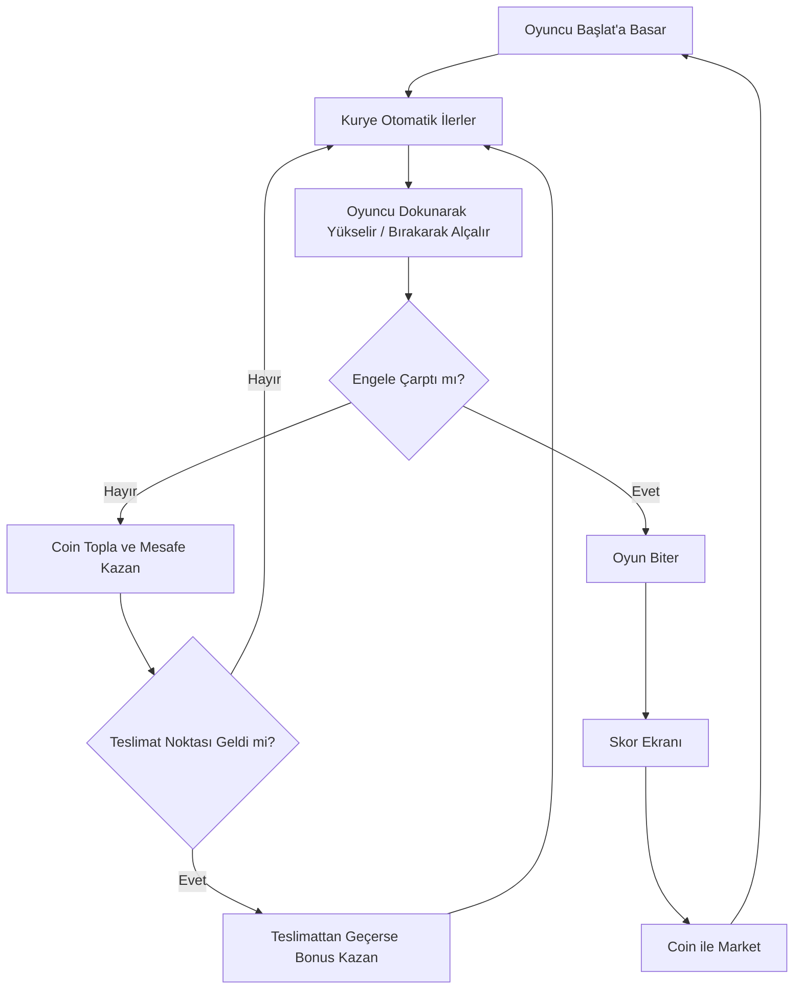

# Kaçak Kurye: Son Paket

## 1. Kısa Tanım

**Kaçak Kurye: Son Paket**, web tabanlı geliştirilecek ve daha sonra Android/Play Store için paketlenebilecek, tek parmakla oynanan sonsuz koşu / sonsuz kaçış türünde bir mobil oyundur.

Oyuncu, gece yarısına kadar son paketi teslim etmeye çalışan motorlu bir kuryeyi kontrol eder. Şehir kaotiktir: açılan araba kapıları, martılar, yola atlayan kediler, çukurlar, zabıta bariyerleri, ani kasisler, yağmur bulutları ve ters yönden gelen scooterlar oyuncuyu durdurmaya çalışır.

Ana amaç basittir:

> **Paketi düşürmeden mümkün olduğunca uzağa git, teslimat noktalarından geç, coin topla ve yeni motorlar/karakterler aç.**

---

## 2. Oyunun Temel Fikri

Flappy Bird gibi kolay anlaşılır, tek dokunuşla oynanan bir mekanik hedeflenir. Ancak oyunun sadece “engellerden kaç” hissinde kalmaması için net bir konu ve amaç vardır: **paketi teslim etmek**.

Oyuncu her denemede daha uzağa gitmeye çalışır. Her 300 metrede bir teslimat noktası çıkar. Oyuncu teslimat noktasından başarıyla geçerse bonus coin ve puan kazanır. Böylece sonsuz koşu yapısına küçük hedefler eklenir.

---

## 3. Oyun Türü

- Tür: Sonsuz koşu / endless runner
- Kontrol: Tek parmak / tek tuş
- Platform: Önce web, sonra Android
- Görsel tarz: 2D, renkli, hafif karikatürize
- Kamera: Yandan görünüm
- Oyun süresi: Ortalama 20 saniye - 2 dakika
- Hedef kitle: 10 yaş ve üzeri, özellikle mobil casual oyuncular

---

## 4. Ana Oynanış Döngüsü

1. Oyuncu oyuna başlar.
2. Kurye otomatik olarak ileri gider.
3. Oyuncu dokunarak/ekrana basarak kuryeyi zıplatır veya yükseltir.
4. Oyuncu engellerden kaçar.
5. Coin toplar.
6. Her 300 metrede bir teslimat noktasından geçmeye çalışır.
7. Kaza yaparsa oyun biter.
8. Skor ve kazanılan coin gösterilir.
9. Oyuncu coinlerle yeni motor, kask, çanta, şehir teması veya karakter açar.
10. Tekrar oynar.

---

## 5. Kontrol Mekaniği

### 5.1 Basit Kontrol

Oyuncu sadece ekrana dokunur.

- **Dokun / basılı tut:** Motor yukarı doğru hareket eder veya ön teker kaldırır.
- **Bırak:** Motor aşağı doğru süzülür.
- **Kısa dokunuş:** Küçük zıplama.
- **Uzun basma:** Daha yüksek çıkış.

Bu mekanik Flappy Bird hissine yakın olmalıdır ama motorlu kurye temasına uygun görünmelidir.

### 5.2 Alternatif Kontrol Seçeneği

İleride ikinci kontrol modu eklenebilir:

- Dokununca zıpla.
- Aşağı kaydırınca eğil.
- Sağa/sola kaydırınca şerit değiştir.

Ancak MVP sürümde sadece tek dokunuş önerilir.

---

## 6. Ana Karakter

Ana karakter gece teslimata çıkan genç bir motorlu kuryedir.

### 6.1 Karakter Özellikleri

- Üzerinde kurye montu vardır.
- Sırtında büyük teslimat çantası bulunur.
- Kask takar.
- Motoru küçük scooter tarzındadır.
- Hafif komik ve karikatürize görünür.
- Panik ama kararlı bir yüz ifadesi vardır.

### 6.2 Ana Karakter Figürü - Metin Tasviri

```text
       _______
     _/_____ /|
    /  O   O  |     <- Kasklı kurye kafası
   |     ^    |
   |   \___/  |
    \_______/
       /|\
  ____/ | \____
 |  DELIVERY  |     <- Sırt çantası
 |____BAG_____|
      /   \
   __/_____\__
  (o)-------(o)     <- Scooter
```

### 6.3 AI Görsel Üretim Promptu

> 2D mobile game character, cartoon style, Turkish night delivery courier riding a small scooter, wearing helmet, oversized delivery backpack, funny determined face, side view, clean vector art, colorful, simple shapes, suitable for endless runner game sprite, transparent background

---

## 7. Oyun Evreni

Oyun Türkiye’deki şehir hayatından esinlenir. Oyuncu tanıdık ama abartılmış bir sokakta ilerler.

### 7.1 Genel Atmosfer

- Gece vakti
- Islak asfalt
- Neon tabela ışıkları
- Apartmanlar
- Büfe, dönerci, bakkal, fırın gibi arka plan detayları
- Sokak kedileri
- Martılar
- Kasisler
- Trafik konileri
- Paket teslim noktaları

### 7.2 Mizah Tonu

Oyun absürt ama sıcak bir mizaha sahip olmalıdır. Şehir tehlikeli görünse bile karanlık veya şiddetli değil, komik ve hareketli hissettirmelidir.

Örnek mizahi detaylar:

- Tabelada “Son Paket 23:59” yazması
- Martının simit değil paket peşinde koşması
- Zabıtanın devasa düdük çalması
- Araba kapısının abartılı şekilde açılması
- Kuryenin çarpınca “Abi paket sağlam mı?” demesi

---

## 8. Ana Oyun Akışı



---

## 9. Skor Sistemi

Skor oyuncuya sürekli ilerleme hissi vermelidir.

### 9.1 Puan Kaynakları

| Aksiyon | Puan |
|---|---:|
| 1 metre ilerleme | +1 |
| Coin toplama | +5 |
| Teslimat noktasından geçme | +100 |
| Paketi hasarsız teslim etme | +250 |
| 3 teslimatı üst üste kaçırmadan yapma | +500 |
| Günlük görev tamamlama | +1000 |

### 9.2 Combo Sistemi

Teslimat noktalarını kaçırmadan geçmek combo oluşturur.

- 1. teslimat: x1
- 2. teslimat: x1.2
- 3. teslimat: x1.5
- 5. teslimat: x2

Oyuncu kaza yaparsa combo sıfırlanır.

---

## 10. Teslimat Noktası Mekaniği

Her 300 metrede bir teslimat noktası çıkar.

### 10.1 Teslimat Noktası Görünümü

Teslimat noktası, yolda veya havada beliren parlak bir geçiş halkası olabilir.

```text
        _____________
      /               \
     |   TESLİMAT      |
     |     NOKTASI     |
      \_____   _______/
            | |
         ___| |___
        |  PAKET  |
        |_________|
```

### 10.2 Kural

Oyuncu teslimat noktasından geçerse:

- Bonus puan alır.
- Coin kazanır.
- Paket teslim animasyonu oynar.
- Yeni paket çantaya otomatik eklenir.

Oyuncu teslimat noktasını kaçırırsa:

- Ceza verilmez ama bonus alamaz.
- Combo kırılır.

---

## 11. Engeller

Engeller oyunun kişiliğini oluşturur. Her engel hem görsel hem mekanik olarak farklı hissettirmelidir.

### 11.1 Açılan Araba Kapısı

**Davranış:** Yol kenarındaki araba kapısı aniden açılır. Oyuncu üstünden veya arasından geçmelidir.

```text
   _________
 _/_______/| 
|  CAR    | |
|_________|/
     \
      \____    <- Açılan kapı
```

**AI Prompt:**

> 2D cartoon obstacle for mobile endless runner, parked car with door suddenly opening, side view, simple vector art, colorful, transparent background, game sprite

---

### 11.2 Martı

**Davranış:** Havada süzülür, bazen yukarı aşağı hareket eder.

```text
        __
   __(o )>
  \______)
     /  \
```

**AI Prompt:**

> Funny cartoon seagull obstacle, side view, flying, mischievous face, 2D vector mobile game sprite, transparent background

---

### 11.3 Yola Atlayan Kedi

**Davranış:** Yolun alt kısmından hızlıca geçer. Oyuncu zıplamalıdır.

```text
   /\_/\\
  ( o.o )
   > ^ <  ---->
```

**AI Prompt:**

> Cute street cat running across road, funny expression, 2D cartoon mobile game obstacle, side view, simple vector style, transparent background

---

### 11.4 Çukur

**Davranış:** Zeminde sabit engel. Oyuncu üzerinden atlamalıdır.

```text
 _______      _______
        \____/
        ÇUKUR
```

**AI Prompt:**

> Cartoon road pothole obstacle, cracked asphalt, 2D side view, mobile game sprite, transparent background

---

### 11.5 Zabıta Bariyeri

**Davranış:** Yolun ortasında bariyer vardır. Oyuncu üstünden geçmelidir.

```text
  |\      /|
  | \____/ |
  | ZABITA |
  |________|
```

**AI Prompt:**

> Funny municipal barrier obstacle with Turkish zabita vibe, orange white road barrier, 2D cartoon side view, mobile game sprite, transparent background

---

### 11.6 Ters Yönden Gelen Scooter

**Davranış:** Karşıdan hızlı gelir. Oyuncu yüksekten geçmelidir.

```text
       O
      /|\
  ___/ | \___
 (o)-----(o)   <----
```

**AI Prompt:**

> Cartoon scooter rider coming from opposite direction, funny panic face, 2D mobile endless runner obstacle, side view, transparent background

---

### 11.7 Ani Kasis

**Davranış:** Yol üzerinde beliren tümsek. Oyuncu zamanında zıplamalıdır.

```text
_________/‾‾‾\_________
        KASİS
```

**AI Prompt:**

> Cartoon speed bump on asphalt road, 2D side view obstacle, simple mobile game vector sprite, transparent background

---

### 11.8 Yağmur Bulutu

**Davranış:** Yukarıdan yağmur bırakır. Yağmur alanına giren oyuncu kısa süre kontrol kaybeder.

```text
     .-~~~-.
  .-(       )-.
 (           )
  `-.___.-'
    | | | |
    | | | |
```

**AI Prompt:**

> Cute dark rain cloud obstacle, cartoon style, dropping rain, 2D mobile game sprite, transparent background

---

## 12. Toplanabilir Objeler

### 12.1 Coin

```text
   ______
 /  ₺₺  \
|   ₺   |
 \______/
```

**Görev:** Market alışverişi için kullanılır.

---

### 12.2 Enerji İçeceği

**Etkisi:** 5 saniyeliğine hız artışı verir.

```text
  ______
 |ENERGY|
 |  ⚡   |
 |______|
```

---

### 12.3 Kask

**Etkisi:** Bir çarpmayı affeder.

```text
   _______
 /         \
|  KASK    |
 \_________/
```

---

### 12.4 Manyetik Çanta

**Etkisi:** Yakındaki coinleri kendine çeker.

```text
  __________
 |  BAG 🧲  |
 |__________|
```

---

## 13. Güçlendirmeler

| Güçlendirme | Etki | Süre |
|---|---|---:|
| Kask | 1 çarpmayı affeder | Tek kullanım |
| Turbo | Hızı ve puanı artırır | 5 sn |
| Manyetik Çanta | Coinleri çeker | 8 sn |
| Yağmurluk | Yağmurdan etkilenmez | 10 sn |
| Ekstra Paket | Teslimatta bonus verir | Tek kullanım |

---

## 14. Karakterler

Oyuncu coin ile yeni karakterler açabilir.

### 14.1 Standart Kurye

- Dengeli karakter
- Başlangıç karakteri
- Ücretsiz

**Prompt:**

> Cartoon Turkish delivery courier on scooter, standard outfit, orange delivery backpack, side view, 2D mobile game sprite, transparent background

---

### 14.2 Usta Kurye

- Daha yaşlı, bıyıklı, sakin karakter
- Paket hasarı bonusu verir

**Prompt:**

> Funny veteran delivery courier with mustache, calm face, riding scooter, 2D cartoon style, Turkish city vibe, side view, transparent background

---

### 14.3 Panik Kurye

- Çok hızlı ama kontrolü biraz zor
- Daha yüksek skor potansiyeli

**Prompt:**

> Panicked young delivery courier on scooter, wide eyes, oversized backpack, fast motion feeling, 2D vector mobile game sprite, transparent background

---

### 14.4 Efsane Kurye

- Nadir karakter
- Altın kask ve özel motor
- Kozmetik olarak prestijli

**Prompt:**

> Legendary delivery courier with golden helmet and stylish scooter, heroic funny pose, 2D cartoon mobile game character, side view, transparent background

---

### 14.5 Martı Kasklı Kurye

- Komik kostüm
- Martı saldırılarına karşı küçük avantaj

**Prompt:**

> Funny delivery courier wearing seagull shaped helmet, riding scooter, cartoon mobile game sprite, humorous Turkish coastal vibe, transparent background

---

## 15. Motorlar

Motorlar sadece kozmetik olabilir. Oyunu pay-to-win yapmamak için başlangıçta motorların özellikleri farklı olmamalıdır.

### 15.1 Başlangıç Scooter

- Basit kırmızı scooter
- Ücretsiz

### 15.2 Eski Kurye Motoru

- Biraz paslı, komik egzozlu
- 1000 coin

### 15.3 Neon Gece Motoru

- Işıklı, gece temasına uygun
- 2500 coin

### 15.4 Altın Paket Motoru

- Nadir görünüm
- 7500 coin

### 15.5 Sahil Motoru

- Yazlık tasarım
- İzmir sahil temasında açılır

---

## 16. Şehir Temaları

### 16.1 İstanbul Ara Sokak

- Dar sokaklar
- Kırmızı tabelalar
- Martılar
- Park etmiş arabalar

### 16.2 İzmir Sahil

- Sahil yolu
- Martılar
- Palmiyeler
- Vapur silüeti

### 16.3 Ankara Yokuş

- Gri binalar
- Kasisler
- Soğuk hava
- Dik yokuşlar

### 16.4 Sanayi Sitesi

- Lastikçiler
- Tamirciler
- Yağ tenekeleri
- Sanayi tabelaları

### 16.5 Gece Yağmur Modu

- Islak asfalt
- Neon yansımaları
- Yağmur bulutları
- Daha zor görüş

---

## 17. Market Sistemi

Coinlerle alınabilecek şeyler:

- Karakter kostümü
- Motor skini
- Kurye çantası
- Kask
- Şehir teması
- Efekt izi
- Başlangıç güçlendirmesi

### 17.1 Örnek Market Fiyatları

| Ürün | Fiyat |
|---|---:|
| Eski Kurye Motoru | 1000 coin |
| Neon Motor | 2500 coin |
| Usta Kurye | 3000 coin |
| Martı Kaskı | 1500 coin |
| İzmir Sahil Teması | 5000 coin |
| Altın Paket Motoru | 7500 coin |

---

## 18. Görev Sistemi

Oyuncunun geri dönmesi için günlük görevler olmalıdır.

### 18.1 Günlük Görev Örnekleri

- Bugün 3 teslimat yap.
- 500 metre git.
- 50 coin topla.
- Martıya çarpmadan 2 dakika oyna.
- 3 defa kask güçlendirmesi kullan.
- Bir oyunda 2 teslimat noktası geç.

### 18.2 Haftalık Görev Örnekleri

- Toplam 10.000 metre git.
- 30 teslimat tamamla.
- 1000 coin topla.
- 5 farklı karakterle oyna.

---

## 19. Reklam ve Para Kazanma

MVP için agresif reklam önerilmez. Oyuncuyu boğmayan ödüllü reklam sistemi daha mantıklıdır.

### 19.1 Ödüllü Reklam Kullanımları

- Kaza sonrası 1 kez devam et.
- Oyun sonu coinleri 2x yap.
- Günlük ücretsiz sandık aç.
- Geçici kask kazan.

### 19.2 Premium Seçenekleri

- Reklamsız sürüm
- Özel karakter paketi
- Özel şehir teması
- Başlangıç coin paketi

### 19.3 Dikkat Edilmesi Gerekenler

- Oyun pay-to-win olmamalıdır.
- Reklam her ölümden sonra zorla gösterilmemelidir.
- Ödüllü reklam oyuncuya avantaj sağlamalı ama zorunlu olmamalıdır.

---

## 20. MVP Kapsamı

İlk sürümde sadece gerekli özellikler yapılmalıdır.

### 20.1 MVP’de Olacaklar

- Ana menü
- Oyun ekranı
- Tek dokunuş kontrol
- Sonsuz yol
- Mesafe skoru
- Coin toplama
- 6 temel engel
- 1 şehir teması
- 1 karakter
- 3 motor skini
- Oyun sonu ekranı
- Restart butonu
- Basit market
- Local storage ile coin/skor kaydı

### 20.2 MVP’de Olmayacaklar

- Online liderlik tablosu
- Kullanıcı hesabı
- Multiplayer
- Karmaşık görev sistemi
- Gerçek para mağazası
- Çoklu şehirler
- Çok gelişmiş animasyonlar

---

## 21. İlk Sürüm Ekranları

### 21.1 Ana Menü

İçerikler:

- Oyun logosu
- “Başla” butonu
- “Market” butonu
- “En İyi Skor” bilgisi
- Coin miktarı

```text
+-----------------------------+
|       KAÇAK KURYE           |
|        SON PAKET            |
|                             |
|        [ BAŞLA ]            |
|        [ MARKET ]           |
|                             |
|   En İyi Skor: 1850 m       |
|   Coin: 1240                |
+-----------------------------+
```

---

### 21.2 Oyun Ekranı

```text
+-----------------------------+
| Skor: 450m        Coin: 12  |
|                             |
|       🪙                    |
|              MARTI          |
|                             |
|   KURYE ----->              |
|_____________      __________|
|             \____/          |
+-----------------------------+
```

---

### 21.3 Oyun Sonu Ekranı

```text
+-----------------------------+
|        KAZA YAPTIN!         |
|                             |
|   Mesafe: 820 m             |
|   Teslimat: 2               |
|   Kazanılan Coin: 95        |
|                             |
|   [ TEKRAR OYNA ]           |
|   [ COIN 2X - REKLAM ]      |
|   [ MARKET ]                |
+-----------------------------+
```

---

## 22. Görsel Stil Rehberi

### 22.1 Genel Stil

- 2D cartoon
- Clean vector art
- Kalın dış çizgi
- Renkli ama göz yormayan palet
- Arka plan hafif bulanık veya düşük kontrast
- Oynanabilir alan net olmalı

### 22.2 Kamera ve Kompozisyon

- Kamera yandan bakar.
- Karakter ekranın sol-orta kısmında kalır.
- Engeller sağdan sola gelir.
- Arka plan parallax ile hareket eder.

### 22.3 Renk Hissi

- Gece mavisi arka plan
- Neon sarı/turuncu tabelalar
- Kuryede turuncu veya kırmızı çanta
- Coinlerde altın sarısı
- Tehlikeli engellerde kırmızı/turuncu vurgu

---

## 23. Ses Tasarımı

### 23.1 Ses Efektleri

- Motor sesi
- Coin toplama sesi
- Teslimat başarılı sesi
- Martı çığlığı
- Korna sesi
- Zabıta düdüğü
- Kaza sesi
- Turbo sesi

### 23.2 Müzik

- Hızlı ama rahatsız etmeyen şehir ritmi
- Hafif elektronik / arcade tarz
- Oyuncu uzun süre oynasa da yormamalı

---

## 24. Zorluk Eğrisi

Oyun başlangıçta kolay olmalı, sonra hızlanmalıdır.

### 24.1 Zorluk Artışı

| Mesafe | Zorluk |
|---:|---|
| 0-300 m | Kolay, az engel |
| 300-700 m | Orta, hareketli engeller başlar |
| 700-1200 m | Hız artar, kombine engeller gelir |
| 1200 m+ | Daha dar geçişler ve hızlı engeller |

### 24.2 Dikkat

Zorluk adil olmalıdır. Oyuncu “hata bende” demeli. Rastgele ve kaçınılmaz engel oluşturulmamalıdır.

---

## 25. Teknik Öneri

### 25.1 Web Teknolojileri

Önerilen yapı:

- React + Vite
- Phaser.js veya Canvas tabanlı basit oyun motoru
- LocalStorage ile skor ve coin kaydı
- Daha sonra Capacitor ile Android paketleme

### 25.2 Oyun Motoru Seçimi

**Phaser.js** önerilir çünkü 2D web oyunları için uygundur.

Kullanılabilecek temel yapılar:

- Player class
- Obstacle class
- Coin class
- DeliveryPoint class
- GameScene
- MenuScene
- ShopScene
- GameOverScene

---

## 26. Dosya Yapısı Önerisi

```text
kacak-kurye/
├── public/
│   ├── assets/
│   │   ├── characters/
│   │   ├── obstacles/
│   │   ├── backgrounds/
│   │   ├── ui/
│   │   └── sounds/
├── src/
│   ├── game/
│   │   ├── scenes/
│   │   │   ├── BootScene.js
│   │   │   ├── MenuScene.js
│   │   │   ├── GameScene.js
│   │   │   ├── ShopScene.js
│   │   │   └── GameOverScene.js
│   │   ├── entities/
│   │   │   ├── Player.js
│   │   │   ├── Obstacle.js
│   │   │   ├── Coin.js
│   │   │   └── DeliveryPoint.js
│   │   ├── config.js
│   │   └── data/
│   │       ├── skins.json
│   │       ├── obstacles.json
│   │       └── missions.json
│   ├── App.jsx
│   └── main.jsx
├── package.json
└── README.md
```

---

## 27. Codex İçin İlk Geliştirme Promptu

Aşağıdaki prompt Codex veya başka bir AI kodlama aracına verilebilir:

```text
React + Vite + Phaser.js kullanarak “Kaçak Kurye: Son Paket” adlı 2D sonsuz koşu oyununun MVP sürümünü geliştir.

Oyun yandan görünümlü olacak. Oyuncu bir motorlu kuryeyi kontrol edecek. Kurye otomatik olarak ileri gidiyormuş gibi görünmeli, engeller sağdan sola hareket etmeli.

Kontrol:
- Ekrana basınca veya mouse/touch input alınca oyuncu yukarı doğru ivme kazansın.
- Bırakınca yerçekimi etkisiyle aşağı insin.
- Oyuncu ekran dışına çıkarsa veya engele çarparsa oyun bitsin.

MVP özellikleri:
- Ana menü
- Oyun ekranı
- Oyun sonu ekranı
- Skor/metre sistemi
- Coin toplama
- 6 engel tipi: araba kapısı, martı, kedi, çukur, zabıta bariyeri, kasis
- Her 300 metrede bir teslimat noktası
- Teslimat noktasından geçince +100 puan ve +25 coin
- Coin ve en iyi skor localStorage’da saklansın
- Basit market ekranı olsun; 3 motor skini satın alınabilsin
- Asset yoksa geçici basit geometrik şekiller kullanılsın
- Mobil tarayıcıya uyumlu responsive yapı olsun
- Kod okunabilir, component/scene yapısı temiz olsun
```

---

## 28. AI Görsel Üretim İçin Asset Listesi

Aşağıdaki assetler üretilebilir.

### 28.1 Ana Karakter Sprite

> 2D mobile game sprite, Turkish delivery courier riding small scooter, helmet, orange oversized delivery backpack, funny determined face, side view, cartoon vector style, clean outline, transparent background

### 28.2 Arka Plan - Gece Şehri

> 2D cartoon night city street background, Turkish urban neighborhood, small shops, apartment buildings, neon signs, wet asphalt, side scrolling mobile game background, parallax layers, colorful but not too busy

### 28.3 Coin

> 2D cartoon gold coin with Turkish lira symbol, mobile game collectible, shiny, simple vector icon, transparent background

### 28.4 Teslimat Noktası

> 2D cartoon delivery checkpoint gate, glowing ring, package icon, mobile endless runner game asset, side view, transparent background

### 28.5 Araba Kapısı Engeli

> 2D cartoon parked car with door opening suddenly, side view, mobile game obstacle, clean vector style, transparent background

### 28.6 Martı Engeli

> Funny cartoon seagull flying, mischievous face, side view, 2D mobile game obstacle sprite, transparent background

### 28.7 Kedi Engeli

> Cute street cat running across road, funny motion pose, 2D cartoon mobile game obstacle, transparent background

### 28.8 Çukur Engeli

> Cartoon asphalt pothole with cracked road edges, 2D side view, mobile endless runner obstacle, transparent background

### 28.9 Zabıta Bariyeri

> Cartoon orange white municipal road barrier, Turkish street vibe, 2D mobile game obstacle, side view, transparent background

### 28.10 Kasis Engeli

> Cartoon speed bump on asphalt road, 2D side scrolling mobile game obstacle, transparent background

---

## 29. Basit Oyun Dengesi

### 29.1 Başlangıç Değerleri

| Değer | Öneri |
|---|---:|
| Başlangıç hızı | 220 px/s |
| Yerçekimi | 900 px/s² |
| Dokunma itişi | -350 px/s |
| Engel çıkış aralığı | 1.5 - 2.2 sn |
| Coin çıkış aralığı | 0.8 - 1.4 sn |
| Teslimat noktası | Her 300 m |
| İlk oyun hedef süresi | 30-45 sn |

### 29.2 Zorluk Artışı

Her 300 metrede:

- Hız %5 artsın.
- Engel aralığı biraz azalsın.
- Hareketli engel ihtimali artsın.

---

## 30. Başarı Kriterleri

MVP başarılı sayılması için:

- Oyun ilk 5 saniyede anlaşılmalı.
- Oyuncu öldüğünde hemen tekrar oynamak istemeli.
- Ortalama ilk oturumda en az 5 deneme yapılmalı.
- İlk sürümde oyun hissi tatmin edici olmalı.
- Grafikler mükemmel olmasa bile karakter ve tema net anlaşılmalı.

---

## 31. Sosyal Medya İçerik Fikirleri

Oyunu büyütmek için kısa videolar:

1. “Türkiye’de kurye olmak oyun olsaydı...”
2. “Son paketi yetiştirmeye çalışıyorum ama martı saldırdı.”
3. “Bu oyunu 1 haftada yaptım.”
4. “Kuryeyi çukura düşürmeden 1000 metre gidebilir misin?”
5. “Yeni engel ekledim: açılan araba kapısı.”
6. “Yorumlara yaz, oyuna hangi şehir gelsin?”
7. “Manisa modu gelsin mi?”

---

## 32. İsim Alternatifleri

- Kaçak Kurye
- Son Paket
- Gece Teslimatı
- Paket Peşinde
- 23:59 Kurye
- Kurye Kaçışı
- Motorlu Mesai
- Son Teslimat

En güçlü isim önerisi:

> **Kaçak Kurye: Son Paket**

Çünkü hem aksiyon hissi var hem de hedef net.

---

## 33. Logo Fikri

Logo şu unsurları içerebilir:

- Büyük dinamik yazı: “KAÇAK KURYE”
- Alt başlık: “SON PAKET”
- Arkada scooter silüeti
- Uçan paket
- Hafif hız çizgileri
- Turuncu/sarı neon vurgu

**Logo Promptu:**

> Mobile game logo, text “Kaçak Kurye”, subtitle “Son Paket”, cartoon delivery scooter, flying package, speed lines, Turkish urban night vibe, bold playful typography, colorful vector style

---

## 34. En Önemli Tasarım Kararları

- Oyun tek dokunuşla oynanmalı.
- İlk sürümde görsel mükemmellik değil oyun hissi öncelik olmalı.
- Engeller adil olmalı.
- Her 300 metrede teslimat noktası oyuncuya hedef hissi vermeli.
- Coin ekonomisi çok cimri olmamalı.
- Reklam zorlayıcı olmamalı.
- Oyunun mizahı tanıdık ama rahatsız edici olmamalı.
- Marka adı, gerçek şirket logosu, gerçek kurye firmaları kullanılmamalı.

---

## 35. Final Özet

**Kaçak Kurye: Son Paket**, Flappy Bird kadar basit ama Türkiye şehir hayatına dayanan daha karakterli bir sonsuz koşu oyunudur. Oyuncu, motorlu bir kuryeyi yöneterek paket teslim etmeye çalışır. Her denemede daha uzağa gitmek, coin toplamak, teslimat noktalarından geçmek ve yeni kozmetikler açmak ana motivasyondur.

MVP küçük tutulmalı, önce oyun hissi test edilmelidir. Eğer temel döngü eğlenceliyse sonrasında şehir temaları, karakterler, günlük görevler, liderlik tablosu ve reklam gelir modeli eklenebilir.

